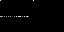

# 6502
Minimal implementation of 6502 CPU in C with 0 dependencies

# Basic usage (C + OpenGL)
`./6502_lcd sierp0.bin`
```
DEBUG=0
SPEED_LIMIT=1
 0.188177, GL_init OK
 read file sierp0.bin, 29 bytes
```


# No GL
Functional test:
`./6502 ./test_roms/6502_functional_test.bin 30646176`

Reference output:

```
3466  8D 00 02  STA $0200       A:F0 X:0E Y:FF P:E1 SP:FF CYC:275
ticks 30646176, time 0.319642 s, MHz 95.877
```

# Python

Program execution:
```
python3 6502.py -i sierp0.bin -o sierp0.gif
```

RIGHT: The framebuffer

LEFT: The memory region 0 - 0x200 and 0x600- ( ZP, STACK, PROGRAM )



Use GA to 'learn' a program:
```
python3 train.py
```
```
    0.8 generation   0 fitness 4.000 avg 0.885
    1.5 generation   1 fitness 9.000 avg 5.205
    2.1 generation   2 fitness 14.000 avg 9.797
    2.8 generation   3 fitness 19.000 avg 11.822
    3.5 generation   4 fitness 25.000 avg 5.662
    4.1 generation   5 fitness 45.000 avg 16.957
    4.8 generation   6 fitness 60.000 avg 25.122
    5.5 generation   7 fitness 62.000 avg 30.992
    6.1 generation   8 fitness 66.000 avg 36.430
    6.8 generation   9 fitness 72.000 avg 41.417
    7.4 generation  10 fitness 82.000 avg 48.390
    8.1 generation  11 fitness 84.000 avg 56.347
    8.7 generation  12 fitness 126.000 avg 63.833
    9.4 generation  13 fitness 130.000 avg 75.165
   10.0 generation  14 fitness 132.000 avg 79.627
   10.6 generation  15 fitness 134.000 avg 84.707
   11.3 generation  16 fitness 141.000 avg 91.855
```
It will also store GIF files for the framebuffer given some interval.
